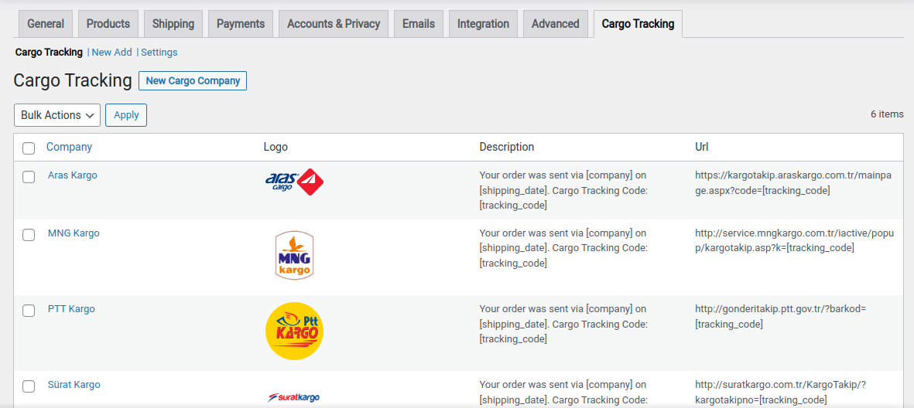
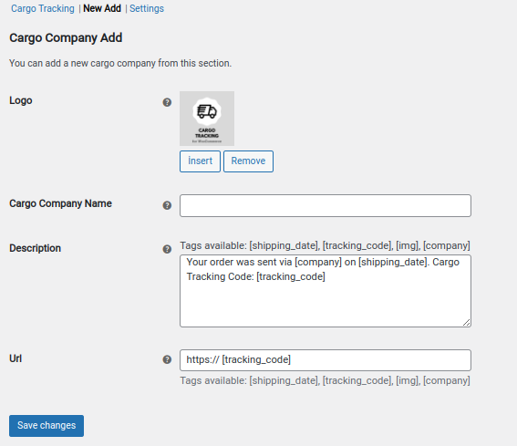
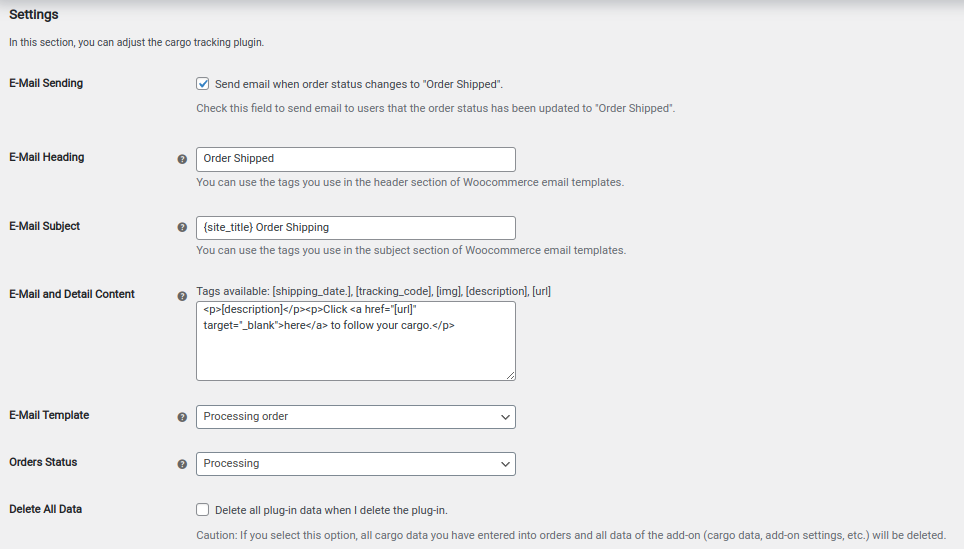
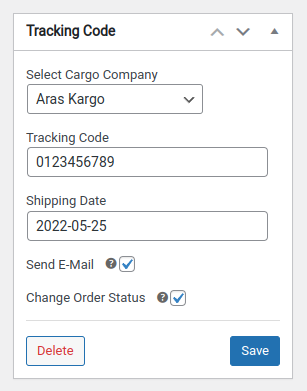
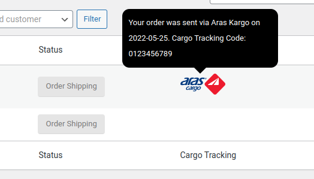
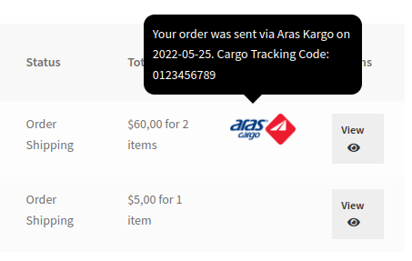
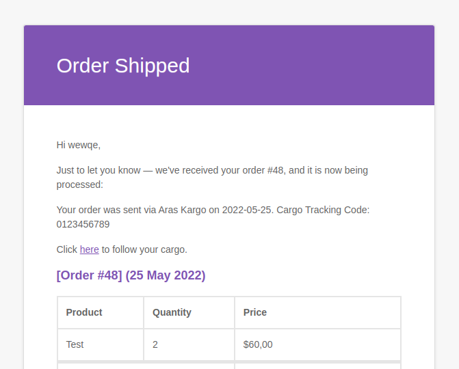

# Cargo Tracking for WooCommerce

With WooCommerce cargo tracking add-on, you can add as many cargo companies as you want and follow the cargo from users and order details.

## Plugin Functionality

- "Order Shipped" status for WooCommerce.
- Ability to add unlimited shipping companies.
- Ability to enter shipping date.
- Changing order status when shipping information is entered.
- Ability to send e-mail containing order information when shipping information is entered.
- Customizing e-mail content.
- Being able to see the cargo tracking link on the My Account page.
- Being able to see the cargo tracking links in the admin orders table.
- Ability to change the status of orders to a different state when you remove the plugin.
- Ability to delete all data of the add-on when you remove the add-on.

## Screenshots

#### Cargo Companies

#### Cargo Company Add

#### Settings

#### Tracking Code

#### Admin View

#### User View

#### Mail View

## License

This project is under the GPLv3 license.
